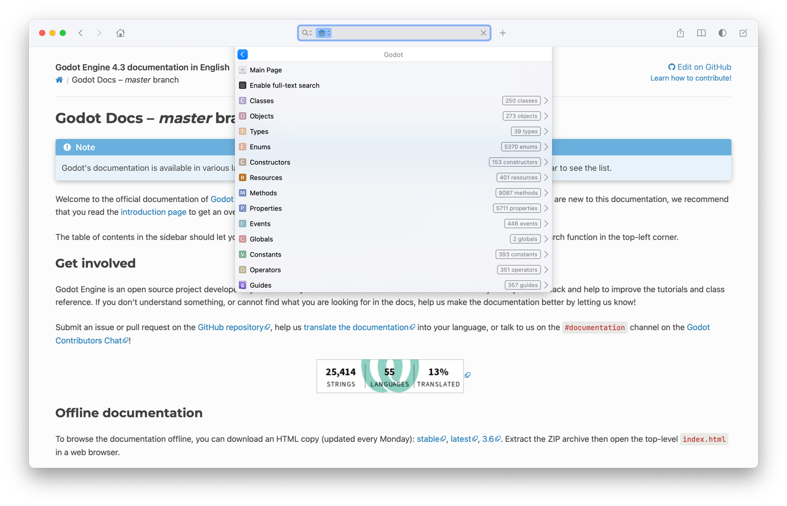

In this blog post, I introduce a tool I developed to convert Godot HTML documentation into a Docset for offline viewers
like [Dash] or [Zeal]. The tool parses Godot's documentation, organizing it into categories compatible with Dash, to
provide an enhanced navigation and search experience.

<!--more-->

## What does the tool do?

The tool parses the Godot documentation to enhance the experience in Dash:

* **Navigation**: The tool organizes the documentation into categories that match the Dash entry types.
* **Search**: The tool generates an index file that Dash uses to search the documentation.
* **Table of Contents**: The tool generates a table of contents for each page in the documentation.

### Navigation

The tool organizes the documentation into categories that match the Dash entry types. Categorisation improves the 
search experience.

The following table shows the mapping of the Dash entry types to the corresponding types used in the Godot 
documentation:

| Dash Entry Type | Godot Documentation                  |
|:----------------|:-------------------------------------|
| Class           | Node                                 |
| Object          | Other classes (RenderingServer, etc) |
| Resource        | Resource                             |
| Global          | Global                               |
| Type            | Core types (float), variants, etc    |
| Event           | Signal                               |
| Enum            | Enumeration                          |
| Constant        | Constant                             |
| Guide           | Tutorial                             |
| Property        | Property                             |
| Method          | Method                               |

[Dash]: https://kapeli.com/dash
[Zeal]: https://zealdocs.org