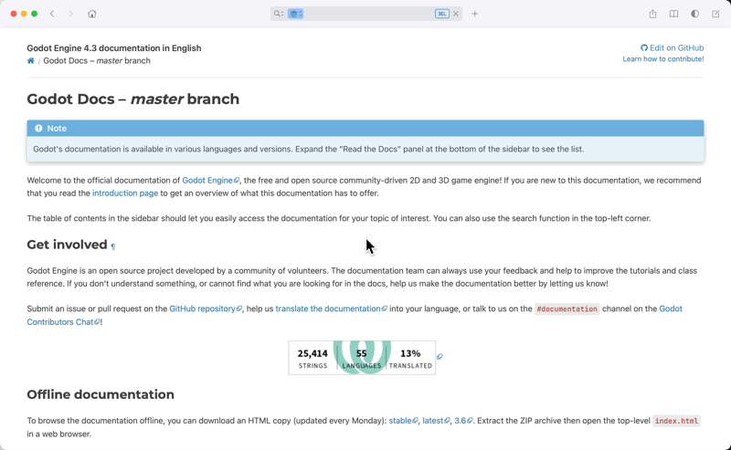
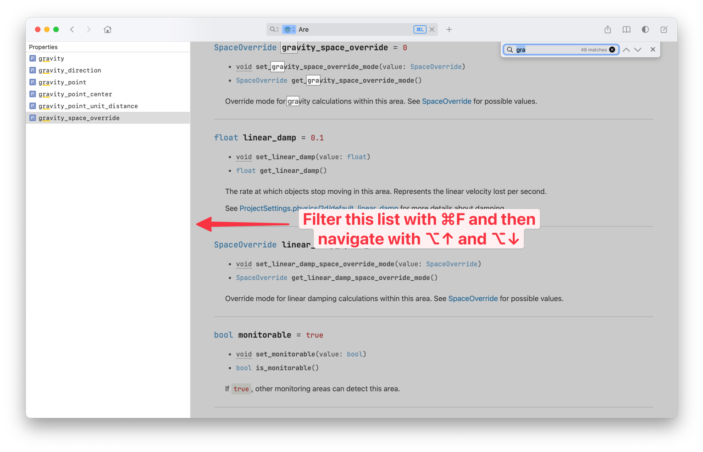

In this article, I introduce a new way to view Godot documentation offline using viewers like [Dash] or [Zeal]. 
Further, I describe some key features that enhance the experience of using the Godot documentation in these tools.

<!--more-->

## What is it?

The Godot docset is derived from the offline documentation available from the [godot-docs] repository,
and is processed by a custom tool[^1] to enhance the experience in Dash in the following ways:

* **Navigation and Search**: The tool organizes the documentation into categories that match the Dash entry types.
* **Page Index**: The tool generates a table of contents for each page in the documentation.

[^1]: The tool and instructions are available via the [godot-dash] repository.

### Navigation and Search

The tool organizes the documentation into categories that match the Dash entry types. Categories improve the 
search experience.



The following table lists the mapping of the [Dash entry types] to the corresponding types used in the Godot 
documentation:

| Dash Entry Type | Godot Documentation                  |
|:----------------|:-------------------------------------|
| Class           | Node                                 |
| Object          | Other classes (RenderingServer, etc) |
| Resource        | Resource                             |
| Global          | Global                               |
| Type            | Core types (float), variants, etc    |
| Event           | Signal                               |
| Enum            | Enumeration                          |
| Constant        | Constant                             |
| Guide           | Tutorial                             |
| Property        | Property                             |
| Method          | Method                               |

For example, if you want to limit your search to Godot classes derived from `Node`, you can select the `Class` category
in Dash:

### Page Index

The tool generates a table of contents for each page in the documentation. This feature allows you to quickly navigate
to a specific section of a page.



You can search the page and filter the table of contents by pressing `Cmd + F`. 

## How do I get it?

You will have to build the docset yourself for now. I have plans to automate the generation and submit it as a 
[User Contribution]. See the [godot-dash] GitHub repository for instructions on building it yourself.

[Dash]: https://kapeli.com/dash
[Zeal]: https://zealdocs.org
[Dash entry types]: https://kapeli.com/docsets#supportedentrytypes
[godot-dash]: https://github.com/stuartcarnie/godot-dash
[godot-docs]: https://github.com/godotengine/godot-docs?tab=readme-ov-file#download-for-offline-use
[User Contribution]: https://github.com/Kapeli/Dash-User-Contributions
